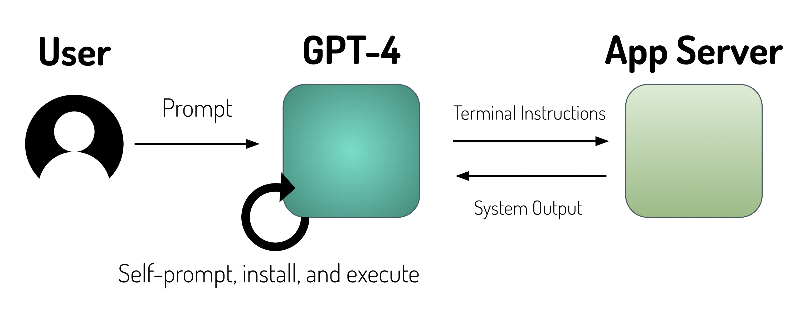
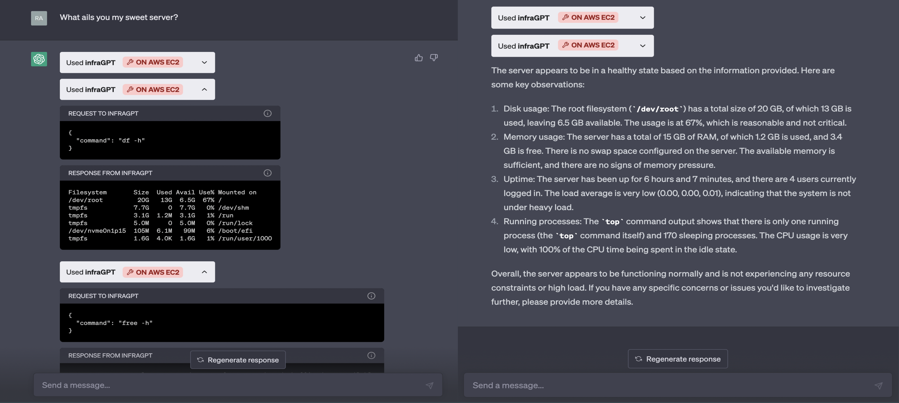

<div align="center">
  
# InfraGPT

*Talk to your servers. Automate your DevOps.*


</div>

InfraGPT connects GPT to your server and enables it to run arbitrary shell commands. This allows you to talk to GPT and it will run commands for you in your server.

<div align="center">
    
    
</div>


# Plugins Quickstart

Get a Todo list ChatGPT plugin up and running in under 5 minutes using Python. If you do not already have plugin developer access, please [join the waitlist](https://openai.com/waitlist/plugins).

## Setup

To install the required packages for this plugin, run the following command:

```bash
pip install -r requirements.txt
```

To run the plugin, enter the following command:

```bash
python main.py
```

Once the local server is running:

1. Navigate to https://chat.openai.com. 
2. In the Model drop down, select "Plugins" (note, if you don't see it there, you don't have access yet).
3. Select "Plugin store"
4. Select "Develop your own plugin"
5. Enter in `localhost:5003` since this is the URL the server is running on locally, then select "Find manifest file".

The plugin should now be installed and enabled! You can start with a question like "What is on my todo list" and then try adding something to it as well! 


## setup fastapi 
cd fastapi/
- ``` python3 -m uvicorn app.main:app --host 0.0.0.0 --port 8000 --reload ```

## run plugin
- python3 main.py
